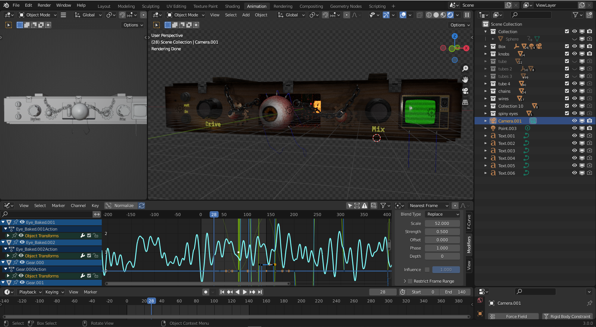

#Diastortion

A Distortion VST compatible with all DAWs that support VST3. Compiles to VST3 and Standalone .exe

##UI
The 3d ui was animated and rendered in Blender, composited in nuke and finaly implemented in the application.

 
The rendered ui (without the knobs or any interactive components as those need to be rendered seperatly) looks something like this

##Distortion Algorithm
Different types from soft/hard clippers to Full-wave rectifiers